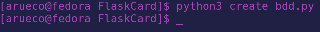
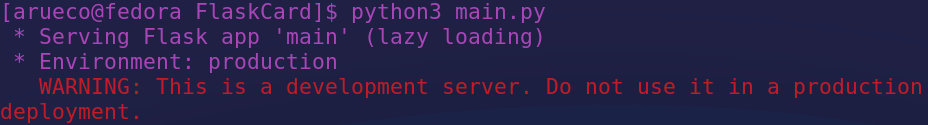
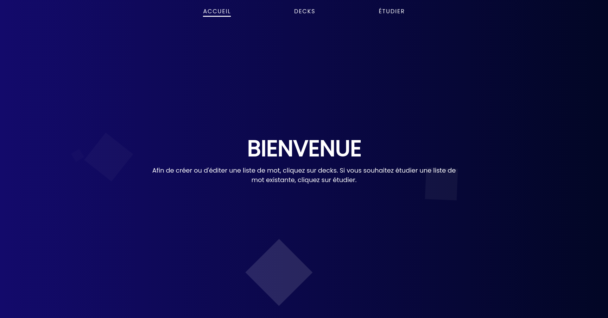
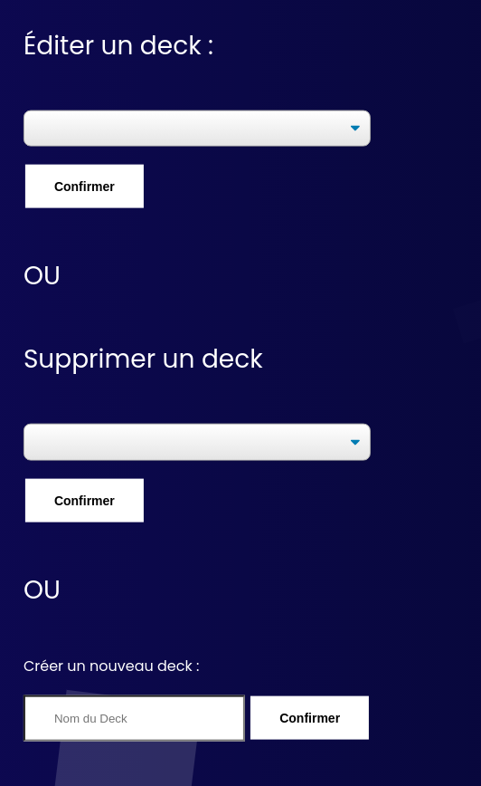
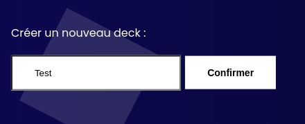
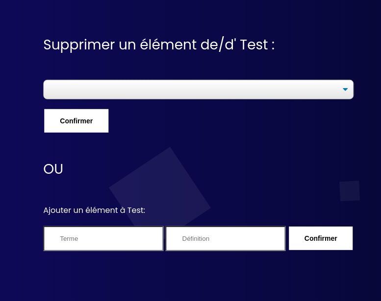
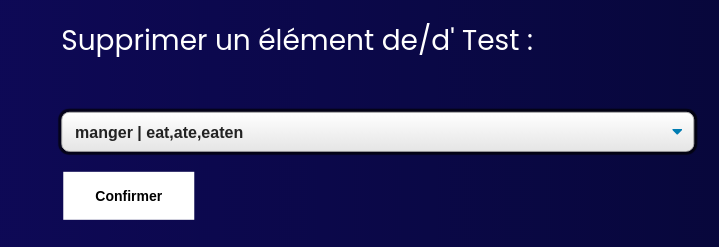
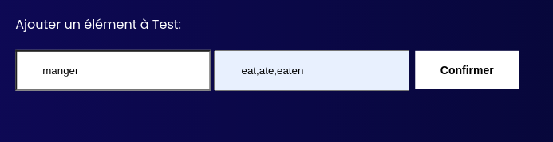
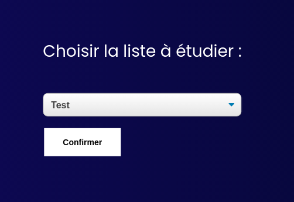
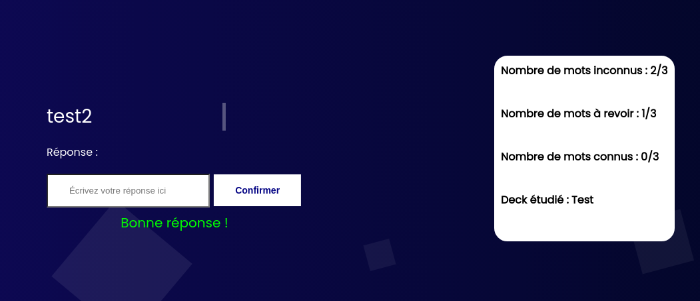

# FlaskCard

## Context

I made this project when I was 17 at school, the only instructions were to use Flask and a SQLite Database. I learn Russian using apps like Anki or Quizlet so I decided to make my own.

## How to use the project :

1 - Download the repository

2 - Create the database, create_bdd.py is made for that :

3 - Start main.py (Flask app) :

And now you can use the web app by typing the IP adress given by the Flask app in your searchbar :

## How it works :

### Create Decks

From top to bottom :

1 - Edit a deck of learning card | **Don't edit if there are no decks, the app will crash**

2 - Delete a deck and its whole content | **Don't delete if there are no decks, the app will crash**

3 - Create a deck (Just enter the name and confirm) :

### Editing deck 

From top to bottom :

1 - Deleting an element of the deck | **Don't delete if there are not any elements, the app will crash** :

2 - Add elements :

### Study a deck 

1 - Choose the deck you want to study | **Don't study if there are no decks, the app will crash** :

2 - Click on "Confirmer"

3 - Study ! You can see your progress on the right :

## Improvements

I need to make an error page to prevent app crashes, but also optimize save.txt files with sessions because it's an ugly way to save a word ...

